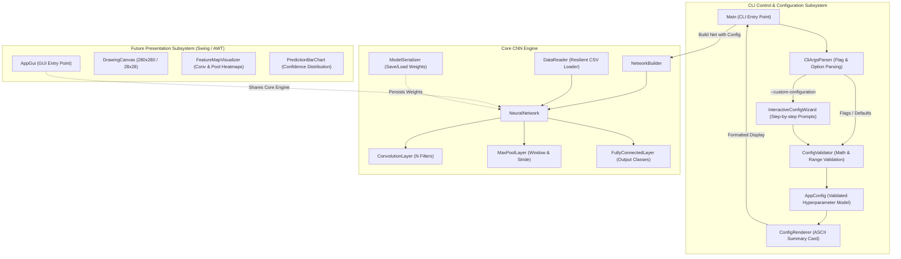
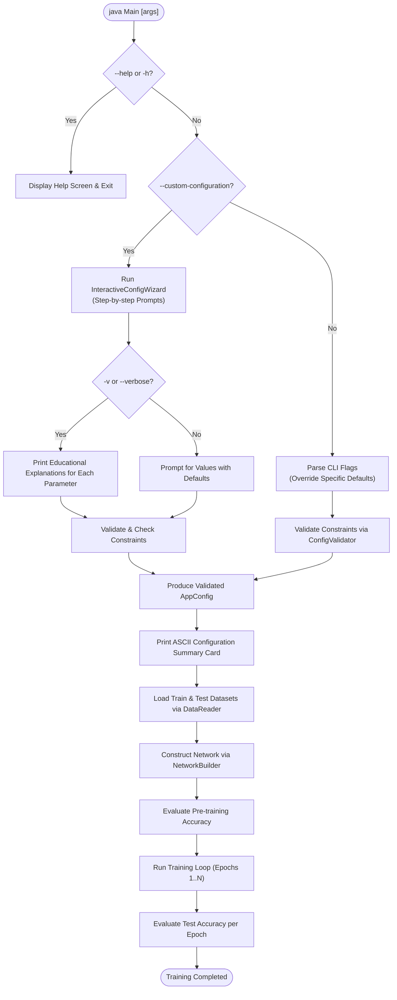

# System Architecture: `java-cnn-char-recog`

## 1. Executive Overview

This project implements a handwritten digit recognition Convolutional Neural Network (CNN) built from scratch using **Core Java** (zero third-party ML frameworks).

The system evolution is organized into two primary milestones:
1. **Milestone 1: Robust CLI Control & Interactive Configuration (Current Focus)**
   - **Default Execution**: Run out-of-the-box with standard hyperparameters, printing a clear ASCII configuration summary.
   - **Flag-Based Customization**: Allow granular flag overrides (e.g. `--epochs 5 --filters 16`) while preserving default values for unmentioned parameters.
   - **Interactive Wizard (`--custom-configuration`)**: Step-by-step guided configuration in the terminal with strict type and mathematical constraint checking.
   - **Educational Verbose Mode (`--verbose` / `-v`)**: Explains what each CNN parameter means, how it impacts memory and accuracy, and recommended bounds.
   - **Help System (`--help` / `-h`)**: Built-in CLI reference manual.
2. **Milestone 2: Model Persistence & Core Java GUI Visualization (Future Focus)**
   - Save and load trained weights without retraining.
   - Interactive 28x28 drawing canvas with real-time predictions.
   - Live visual heatmaps of intermediate CNN activations (Conv filters, MaxPool features, output probabilities).

---

## 2. High-Level Architecture Diagram



---

## 3. CLI Subsystem Architecture (Detailed)

### 3.1 Design Principles for Core Java CLI
- **Zero External Dependencies**: Implemented entirely with Core Java standard library (`java.lang`, `java.util`, `java.io`). No external CLI libraries (such as Picocli or Commons-CLI).
- **Graceful Error Recovery**: If an invalid flag or value is provided, fail immediately with an informative error message and point to `--help`, never crashing with unhandled exceptions.
- **Partial Overrides**: Users should never be forced to supply all parameters; passing a single flag (e.g. `--epochs 10`) updates only epochs and retains all other defaults.

### 3.2 Key CLI Components

#### 1. `AppConfig` (Configuration Data Model)
An immutable, validated configuration object holding:
```java
public class AppConfig {
    // Dataset & Execution
    private final String trainPath;       // Default: "data/mnist_train.csv"
    private final String testPath;        // Default: "data/mnist_test.csv"
    private final int trainLimit;         // Default: 0 (0 = full dataset)
    private final int testLimit;          // Default: 0 (0 = full dataset)
    private final int epochs;             // Default: 3
    private final long seed;              // Default: 123L
    private final double scaleFactor;     // Default: 256.0 * 100.0

    // Convolution Layer
    private final int numFilters;         // Default: 8
    private final int filterSize;         // Default: 5
    private final int convStepSize;       // Default: 1
    private final double convLearningRate;// Default: 0.1

    // Max Pooling Layer
    private final int poolWindowSize;     // Default: 3
    private final int poolStepSize;       // Default: 2

    // Fully Connected Layer
    private final int numClasses;         // Default: 10
    private final double fcLearningRate;  // Default: 0.1

    // CLI Behavior
    private final boolean verbose;        // Default: false
    private final boolean interactive;    // Default: false
}
```

#### 2. `ConfigValidator` (Mathematical & Range Verification)
Validates hyperparameters against both range constraints and CNN mathematical viability:
- **Image Compatibility**: Input is $28 \times 28$.
- **Convolution Output Validity**:
  $$\text{OutRows} = \frac{\text{InRows} - \text{FilterSize}}{\text{ConvStep}} + 1 > 0$$
  $$\text{OutCols} = \frac{\text{InCols} - \text{FilterSize}}{\text{ConvStep}} + 1 > 0$$
  If $\text{FilterSize} > \text{InRows}$ or step size is non-positive, throws a detailed validation error.
- **Pooling Output Validity**:
  $$\text{PoolRows} = \frac{\text{ConvOutRows} - \text{PoolWindow}}{\text{PoolStep}} + 1 > 0$$
  $$\text{PoolCols} = \frac{\text{ConvOutCols} - \text{PoolWindow}}{\text{PoolStep}} + 1 > 0$$
  Verifies that pooling does not reduce feature dimensions to zero or negative.
- **Learning Rates**: $0.0 < \alpha \le 1.0$.
- **Epochs**: $1 \le \text{epochs} \le 1000$.
- **Scale Factor**: $> 0$.

#### 3. `CliArgsParser` (Flag & Argument Parser)
Supports flag parsing with case-insensitivity and synonym handling:
- `--help`, `-h`: Display help documentation.
- `--custom-configuration`, `-c`: Launch interactive wizard.
- `--verbose`, `-v`: Enable detailed explanations.
- `--epochs <N>`, `-e <N>`: Set number of training epochs.
- `--filters <N>`: Number of convolution filters.
- `--filter-size <N>`: Size of convolution kernel ($N \times N$).
- `--conv-stride <N>`: Stride/step size of convolution.
- `--conv-lr <F>`: Learning rate for convolution layer.
- `--pool-window <N>`: Max pooling window dimension ($N \times N$).
- `--pool-stride <N>`: Max pooling step size.
- `--fc-lr <F>`: Learning rate for dense layer.
- `--scale-factor <F>`: Input pixel normalization divisor.
- `--seed <N>`: Random seed for reproducibility.
- `--train-limit <N>`, `--test-limit <N>`: Subsample counts for quick training/eval.
- `--quick`, `-q`: Alias for `--train-limit 200 --test-limit 100`.

#### 4. `InteractiveConfigWizard` (Step-by-Step Prompting)
When `--custom-configuration` is triggered:
1. Iterates through each customizable parameter sequentially.
2. Displays current/default value: `Number of Convolution Filters [default: 8]: `.
3. Pressing Enter accepts default; entering a value validates type and mathematical constraints immediately. If invalid, prints error and prompts again.
4. **Verbose Explanation Mode (`-v`)**:
   Before prompting, outputs educational context:
   ```
   [Parameter: Convolution Filters]
   Meaning: The number of distinct feature detectors (e.g. edge, corner, stroke detectors).
   Impact: More filters increase network representational power but linearly scale memory and computation.
   Recommended range: 4 to 32.
   ```

#### 5. `ConfigRenderer` (Terminal ASCII Formatter)
Displays a cleanly aligned ASCII table summarizing the active configuration before execution:
```
========================================================================
                  CNN CHARACTER RECOGNITION CONFIGURATION                
========================================================================
 [Dataset & Runtime]
   Train Data Path  : data/mnist_train.csv (Limit: All 60000)
   Test Data Path   : data/mnist_test.csv  (Limit: All 10000)
   Epochs           : 3
   Random Seed      : 123
   Scale Factor     : 25600.0 (Input: 28x28)

 [Convolution Layer 1]
   Filters          : 8
   Kernel Size      : 5x5 (Step: 1)
   Output Shape     : 8 x 24x24
   Learning Rate    : 0.1000

 [Max Pooling Layer 1]
   Window Size      : 3x3 (Step: 2)
   Output Shape     : 8 x 11x11 (Total Elements: 968)

 [Fully Connected Layer]
   Input Features   : 968
   Classes (Output) : 10
   Learning Rate    : 0.1000
========================================================================
```

---

## 4. Execution Flowchart



---

## 5. File & Package Organization

```
src/src/
├── Main.java                          # CLI entry point orchestrator
├── cli/
│   ├── AppConfig.java                 # Immutable hyperparameter configuration
│   ├── CliArgsParser.java             # Flag tokenizer and parser
│   ├── ConfigValidator.java           # Math & range verification
│   ├── ConfigRenderer.java            # ASCII summary & table printer
│   └── InteractiveConfigWizard.java   # Terminal wizard with verbose explainers
├── data/
│   ├── DataReader.java                # Resilient CSV parser
│   ├── Image.java                     # Digit representation
│   └── MatrixUtility.java             # Matrix math
├── layers/
│   ├── Layer.java                     # Base layer abstraction
│   ├── ConvolutionLayer.java          # 2D Conv & filter updates
│   ├── MaxPoolLayer.java              # 2D Max Pooling
│   └── FullyConnectedLayer.java       # Dense layer & ReLU
├── network/
│   ├── NeuralNetwork.java             # Network orchestration
│   ├── NetworkBuilder.java            # Config-driven fluent builder
│   └── ModelSerializer.java           # Weights persistence (Phase 2)
└── gui/                               # Core Java GUI (Phase 3+)
    ├── MainWindow.java
    ├── DrawingCanvas.java
    └── FeatureMapVisualizer.java
```
